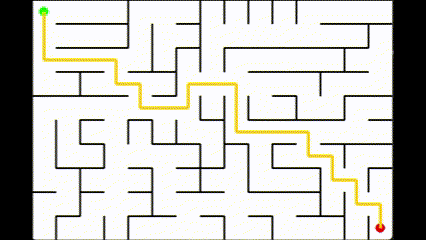

# Path Planning & IMU Simulation Program for HCARD Group project (***v_0.1***)
This project simulates the navigation process and vibration feedback mechanism of visually impaired users wearing our vibration-based auxiliary navigation tool in an indoor maze environment. The program automatically plans the shortest path from the starting point to the destination based on environmental conditions, then guides the user to reach the target location. At each corner, the system determines the required turning angle using position and orientation data received from the IMU, classifies the vibration intensity into three levels based on the absolute angle value, and transmits vibration commands to the device via the communication module. The code implementation regarding vibration command transmission and actual IMU data acquisition requires further refinement.

## 📦 Installation
```bash
pip install pygame
pip install numpy
pip install heapq
```
python version: `3.9.0`

## 🚀 Usage
Simply run the `main.py`, and you can change the parameters in the `Constants.py` file.
```bash
python YOUR/PATH/TO/main.py
```
The Maze is saved in `./maze_data/maze.json` file. If you want to change to another maze, just delete it and run the program again, it will generate a new maze and save it in the same path.

## 🗺️ Core Modules

### 🧭 Path Planning Algorithm
The core of the path planning algorithm is the `PathFinder` class, which uses the ***A-Star algorithm*** with some enhancements to find the shortest path.
```python
# Enhanced A* algorithm implementation
class PathFinder:
    """A* pathfinding implementation"""
    def __init__(self, maze):
        self.maze = maze
        self.path = []
        self._find_path()
        
    def _find_path(self):
        .......... # core codes
```

### 📡 IMU Data (Simulation)
In this simulation code (`imu.py`), I only simulated the IMU data for now (generating data with Gaussian noise). The real-time IMU data can be obtained by capturing the data from the IMU sensor, and you need to add the code for it in the `get_real_imu_data()` function shown below.
```python
class IMUSimulator:
    def get_simulated_imu(self):
        # Implementation details:
        # 1. Gaussian noise injection: Δx~N(0,σ_x), Δy~N(0,σ_y)
        # 2. Heading calculation: θ = arctan2(Δy, Δx) + N(0,σ_θ)
        # 3. Time synchronization: Controlled by update_interval
        # 4. Motion constraints: Max angular velocity 2rad/s
    def get_real_imu_data(self):
        """REAL IMU data need to be captured by IMU sensor"""
        
        ....... # ADD code for capturing real IMU data
        
        return (x, y, theta)
        pass
```

### ⚡ Vibration feedback
Vibration Feedback is implemented to provide feedback to the user when they make a turn. It uses the `actual_diff` value to determine the turn type and provides appropriate vibration feedback. Send the appropriate vibration feedback via Bluetooth to the device by modifying the `send_vibration_command` function in the `application.py` file:
```python
class MainApplication:
    """Main application controller"""
    .....
    def send_vibration_command(self, level):
        '''send vibration command to the device via Bluetooth'''
        ......  # ADD code for sending this command


        pass
```

### 🔍 Multi-level Corner Detection
The system implements a three-tier detection mechanism that intelligently identifies turn types by analyzing continuous angular differences (`actual_diff`) along the path.
| Level | Angle Range | Detection Logic | Output Example | Vibration feedback |
|-------|-------------|-----------------|----------------|----------------|
| 1     | 10°-60°     | `10 ≤ actual_diff ≤ 60` | "Left turn detected! Level: 1 (Angle: 45.0°)" | Level 1|
| 2     | 61°-120°    | `61 ≤ actual_diff ≤ 120` | "Right turn detected! Level: 2 (Angle: 90.5°)" | Level 2|
| 3     | 121°-180°   | `121 ≤ actual_diff ≤ 180` | "Left turn detected! Level: 3 (Angle: 135.2°)" |Level 3|
| 0     | <10° or >180° | \\ | No detection output |None|

### 🛠️ Parameters and Constants
The key parameters used in the simulation are defined in the `Constants.py` file, including the maze size, and the parameters for the pygame window and the IMU data (noise and detection interval). The start and end points could be defined in `maze.json`.
```json
"start": [
    0,
    0
  ],
  "end": [
    9,
    14
  ]
```

## ▶️ Demo

