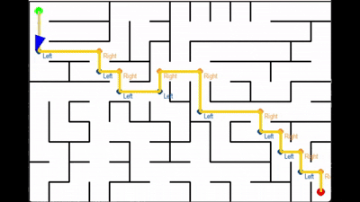

# Path Planning & IMU Simulation Program for HCARD Group project (***v_0.4***)
This project simulates the navigation process and vibration feedback mechanism of visually impaired users wearing our vibration-based auxiliary navigation tool in an indoor maze environment. The program automatically plans the shortest path from the starting point to the destination based on environmental conditions, then guides the user to reach the target location. At each corner, the system determines the required turning angle using position and orientation data received from the IMU, and transmits vibration commands to the device via the communication module. The code implementation regarding vibration command transmission and actual IMU data acquisition requires further refinement.
## ✨ What's new in ***v_0.4***
The visualization window style has been changed. Now, the upper part of the window displays the maze, the user's pose, trajectory, and turning points, while the lower part shows an information panel. This panel presents the user's position and orientation and indicates whether the user should turn left or right using two arrows. For details, please refer to the demo below：

## ▶️ Demo



## 📦 Installation
1. Install the required packages using pip in your conda environment.
    ```bash
    conda activate YOUR_ENV_NAME
    pip install pygame
    pip install numpy
    pip install matplotlib
    pip install scipy
    ```
    Recommended python version: `3.9.12`
2. Install [HIMUServer package](https://github.com/ianovir/HIMUServer.git) in your conda environment. This package allows the program to receive data from phone's IMU.
3. Install [HyperIMU application](https://play.google.com/store/apps/details?id=com.ianovir.hyper_imu) in your cellphone. 

## 🚀 Usage
1. Make sure your phone is connected to the same hotspot as your computer, and change the "Server IP address" in HyperIMU application to the IP address of your computer (this couuld be found by running `ipconfig` in PowerShell).
2. Open a terminal and run `main.py`. You can change the parameters in the `Constants.py` file.
   ```bash
   python YOUR/PATH/TO/main.py
   ```
   Now you should able to see a pygame window. The Maze is saved in `./maze_data/maze.json` file. If you want to change to another maze, just delete it and run the program again, it will generate a new maze and save it in the same path.
3. Open another terminal and run `position_tracking.py`. You should see the following outputs in the terminal:
   ```bash
   protocol: TCP
   RAW: no
   waiting for connection...
   ```
4. In HyperIMU app, just press the green button ("Press to start"), and the program will start to receive data from the phone.

## 🗺️ Core Modules

### 🧭 Path Planning Algorithm
The core of the path planning algorithm is the `PathFinder` class, which uses the ***A-Star algorithm*** with some enhancements to find the shortest path.
```python
# Enhanced A* algorithm implementation
class PathFinder:
    """A* pathfinding implementation"""
    def __init__(self, maze):
        self.maze = maze
        self.path = []
        self._find_path()
        
    def _find_path(self):
        .......... # core codes
```
#### 🛠️ ***Updates & Improvements & Bug fixing in v_0.2***
   Added new turn point detection logic to the `PathFinder`. After the ***A-star algorithm*** plans a shortest path, it directly identifies turn points within this path. The previous implementation incorrectly utilized future-generated IMU data (in simulation), which was a logical error that has now been resolved.
   ```python
   def _detect_turn_directions(self):
           """Turn point detection algorithm"""
           self.turn_points = []
           ....... # core codes
   ```

### 📡 IMU Data (Simulation)
In this simulation code (`imu.py`), I only simulated the IMU data for now (generating data with Gaussian noise). The real-time IMU data can be obtained by capturing the data from the IMU sensor, and you need to add the code for it in the `get_real_imu_data()` function shown below.
```python
class IMUSimulator:
    def get_simulated_imu(self):
        # Implementation details:
        # 1. Gaussian noise injection: Δx~N(0,σ_x), Δy~N(0,σ_y)
        # 2. Heading calculation: θ = arctan2(Δy, Δx) + N(0,σ_θ)
        # 3. Time synchronization: Controlled by update_interval
        # 4. Motion constraints: Max angular velocity 2rad/s
    def get_real_imu_data(self):
        """REAL IMU data need to be captured by IMU sensor"""
        
        ....... # ADD code for capturing real IMU data
        
        return (x, y, theta)
        pass
```
#### 🛠️ ***Updates & Improvements & Bug fixing in v_0.3***
   The new function `position_tracking.py` has been updated to receive data from the phone via Bluetooth. The `get_real_imu_data` function now returns the data from the phone.The `send_vibration_command` function still need to be refined to send vibration commands to the phone.
   ```python
    class KalmanFilterHeading:
        def __init__(self, initial_heading=0.0):
            ......
        ......
    
    class MyCustomListener:
        def __init__(self, max_points=100, threshold=20):
            ......
        
        def send_position(self, x, y, heading):
        """ Send position and heading to UDP server """
            ......
        
        def detect_step(self, pitch, current_time):
        """ Detects steps based on pitch maxima and minima with threshold """
            ......
    
    server = HIMUServer()   # receive data from phone
    listener = MyCustomListener()
    server.addListener(listener)
    server.start("TCP", 2055)   # TCP port
   ```


### ⚡ Vibration feedback
Vibration Feedback is implemented to provide feedback to the user when they make a turn. It uses the `actual_diff` value to determine the turn type and provides appropriate vibration feedback. Send the appropriate vibration feedback via Bluetooth to the device by modifying the `send_vibration_command` function in the `application.py` file:
```python
class MainApplication:
    """Main application controller"""
    .....
    def send_vibration_command(self, level):
        '''send vibration command to the device via Bluetooth'''
        ......  # ADD code for sending this command


        pass
```
#### 🛠️ ***Updates & Improvements & Bug fixing in v_0.2***
Unlike previous versions, the program now triggers the vibration command when the user is 12 pixels away from the next turn. This adjustment accounts for potential Bluetooth communication delays, the duration of vibration feedback, and the user’s required reaction time.
```python
if distance <= self.alert_distance:
   path_angle = atan2(dy, dx)
   agent_angle = self.agent.current_heading
   angle_diff = degrees((path_angle - agent_angle + pi) % (2*pi) - pi)
   
   if abs(angle_diff) < self.direction_alingnment:  # Direction alignment threshold
       print(f"Turn {required_direction} {distance:.1f} units ahead!")
       if not SIMULATION_MODE:
           self.send_vibration_command(required_direction)  # Send vibration command (only used in real environment)
       self.next_turn_index += 1
```

### 🔍 Multi-level Corner Detection
<del>The system implements a three-tier detection mechanism that intelligently identifies turn types by analyzing continuous angular differences (`actual_diff`) along the path.
</del>
#### 🛠️ ***Updates & Improvements & Bug fixing in v_0.2***
This feature has been removed because inherent inaccuracies in the IMU sensor can cause discrepancies between the user's actual orientation and the estimated orientation (compared to an ideal noise-free trajectory, this error ranges from 1 to 12 degrees approximately). In certain scenarios, for example, if the user's actual angle relative to a corner is 55 degrees but the IMU inaccurately estimates it as 62 degrees, the user would receive a `level 2` vibration feedback instead of `level 1`. This mismatch could lead to significant deviation, resulting in navigation failure. Moreover, visually impaired users may even face tripping hazards due to such errors.

### 🎯 Parameters and Constants
The key parameters used in the simulation are defined in the `Constants.py` file, including the maze size, and the parameters for the pygame window and the IMU data (noise and detection interval). The start and end points could be defined in `maze.json`.
```json
"start": [
    0,
    0
  ],
  "end": [
    9,
    14
  ]
```
## 🙏 Acknowledgments
- [@Alireza8Kh](https://github.com/Alireza8Kh) developed `position_tracking.py` and is continuously updating and improving it.
